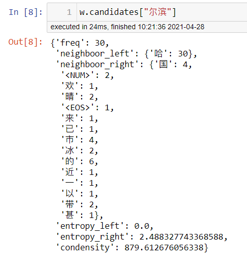
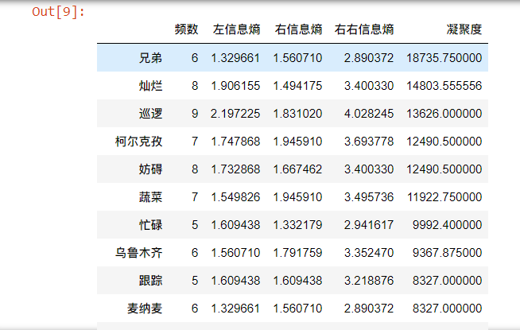

# new-word-detection
## 功能介绍

从给定（未分词）文本中挖掘单词，基本复现了[1]介绍的方法。

## Requirements

- numpy
- pandas
- tqdm

## 使用步骤

见`demo.ipynb`。

```python
from WordTool import WordTool

w=WordTool(content) # 挂载待分析文本，content是string或者list of string
```

```python
# Step 1
# 输入最大词长d，生成所有可能的单词组合。结果见w.pool
w.setPool(d=5)

# Step 2
# 为上一部生成的候选词统计词频
w.countPool()

# Step 3
# 设置最小词频，从pool中筛选出候选词。结果见w.candidates
w.setCandidates(min_freq=5)

# Step 4
# 计算w.candidates中候选词左右邻字的信息熵。会更新w.candidates
w.setCandidatesEntropy()

# Step 5
# 计算w.candidates中候选词的凝聚度。会更新w.candidates
w.setCondensity()
```

至此，挖掘出的可能新词已经更新在`w.candidates`中，可自行处理：



或者利用内置方法`w.display`进行展示：

```python
w.display(sort="condensity", # 按照设定属性从大到小排序，可选condensity,freq,entropy_left,entropy_right
          min_freq=0,
          min_entropy_left=1.3,
          min_entropy_right=1.3,
          min_condensity=100,
          user_dict=None, # 如果给定额外词典，则只展示额外词典中不存在的新词
         )
# w.display方法会将筛选结果更新到w.data中，方便后续处理
```



## 参考

[1] 互联网时代的社会语言学：基于SNS的文本数据挖掘. http://www.matrix67.com/blog/archives/5044